#### 附：Linux LVM 磁盘扩容

- 安装Liunx 必须选择

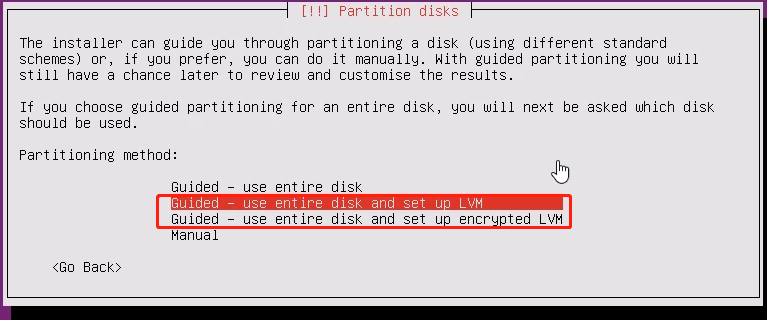  

- 物理卷 Physical volume (PV)

可以在上面建立卷组的媒介，可以是硬盘分区，也可以是硬盘本身或者回环文件（loopback file）。物理卷包括一个特殊的 header，其余部分被切割为一块块物理区域（physical extents）。

- 卷组 Volume group (VG)

将一组物理卷收集为一个管理单元。

- 逻辑卷 Logical volume (LV)

虚拟分区，由物理区域（physical extents）组成。

- 物理区域 Physical extent (PE)

硬盘可供指派给逻辑卷的最小单位（通常为 4MB）。

###### 磁盘操作相关命令
   
查看挂载点:`df -h`

  

显示当前的 logical volume: `lvdisplay`

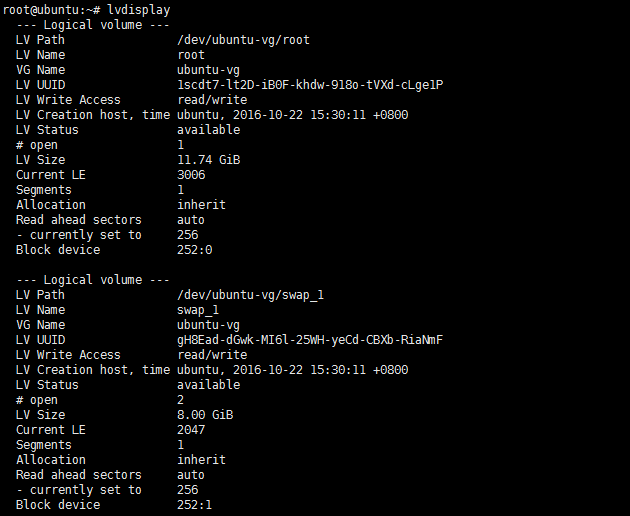  

`备注： 注意这里目前有两个，一个是文件系统所在的 volume，另一个是 swap 分区使用的 volume，当然，我们需要扩容的是第一个`

显示当前的 volume group: `vgdisplay`

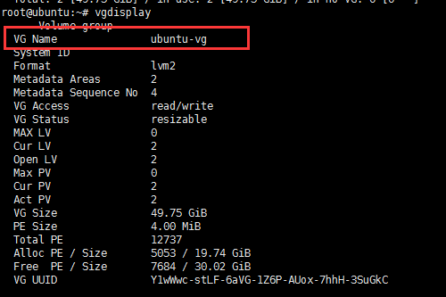  


###### 开始 LVM 扩容

查看 fdisk: `fdisk -l`

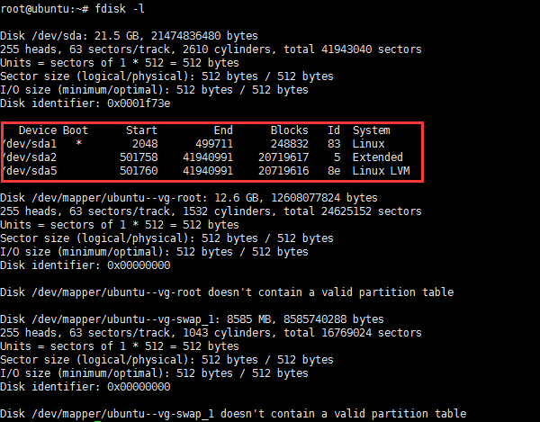  

因为这台机器默认开启了 LVM，所以目前有一个 extended 分区和一个 LVM 分区，并且他们是完全重叠的。这是因为，LVM 分区作为一个虚拟的分区，完全占用了这个 extended 分区，原理图见下：

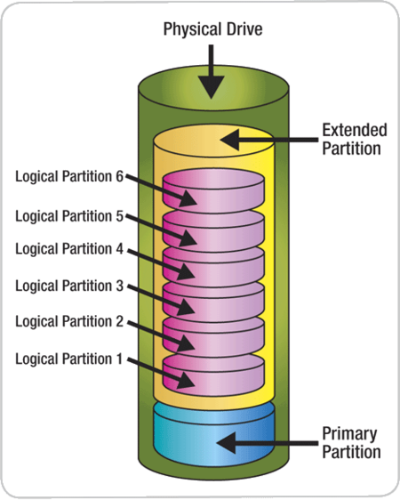 

 `因此，现在需要做的就是将 extended partition (sda2) 扩展到最大，然后创建一个新的 LVM logical partition (sda6)，用它来填满 sda2`
 
查看所有连接到电脑上的储存设备:`fdisk -l |grep '/dev'`

- 块磁盘效果图

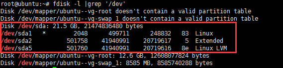 


- 块磁盘效果图（新增磁盘，尚未挂载）

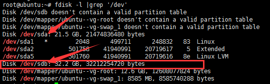 

-  创建 sdb 分区
```
fdisk /dev/sdb
n	# 新建分区
l	# 选择逻辑分区，如果没有，则首先创建扩展分区（p），然后再添加逻辑分区（硬盘：最多四个分区 P-P-P-P 或 P-P-P-E）
```

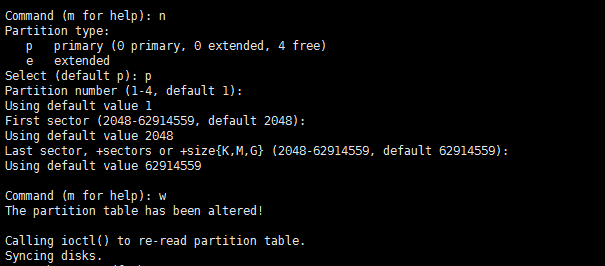 

```
回车
回车
回车
w	# 写入磁盘分区
```
-  格式化磁盘

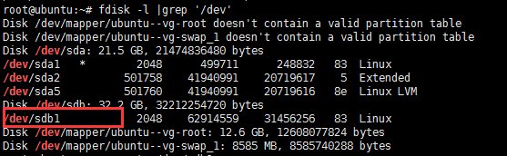 

`mkfs -t ext4 /dev/sdb1`

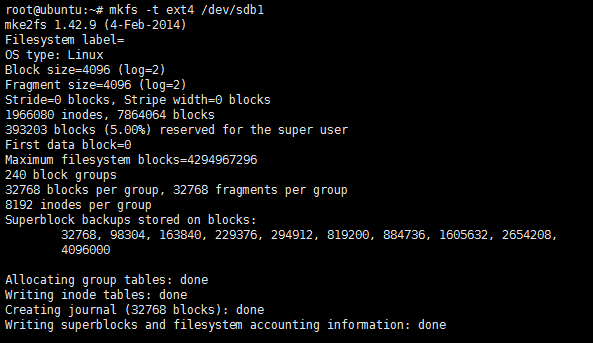 

创建 PV:`pvcreate /dev/sdb1`


查看卷组:`pvscan`

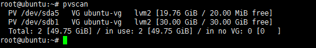 

扩容 VG:`vgdisplay`

 

`vgextend ubuntu-vg /dev/sdb1`


扩容 LV

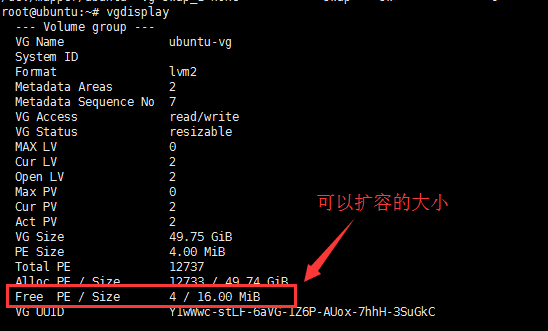 

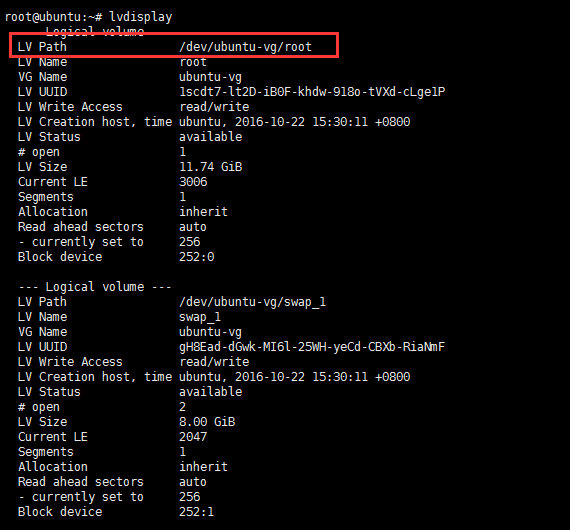 

`lvextend -L +30G /dev/ubuntu-vg/root`

刷新分区: `resize2fs /dev/ubuntu-vg/root`

删除 unknown device: 
```
pvscan
vgreduce --removemissing ubuntu-vg
```
注意：不要卸载扩容的磁盘，可能出现丢失数据或是系统无法启动


 


